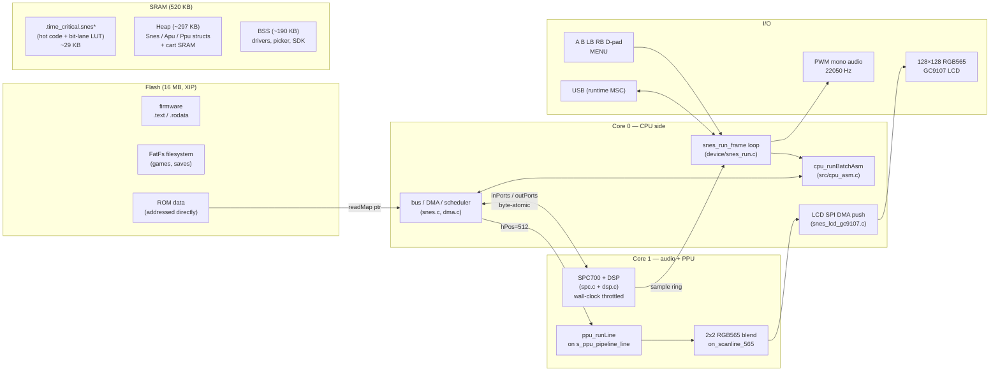
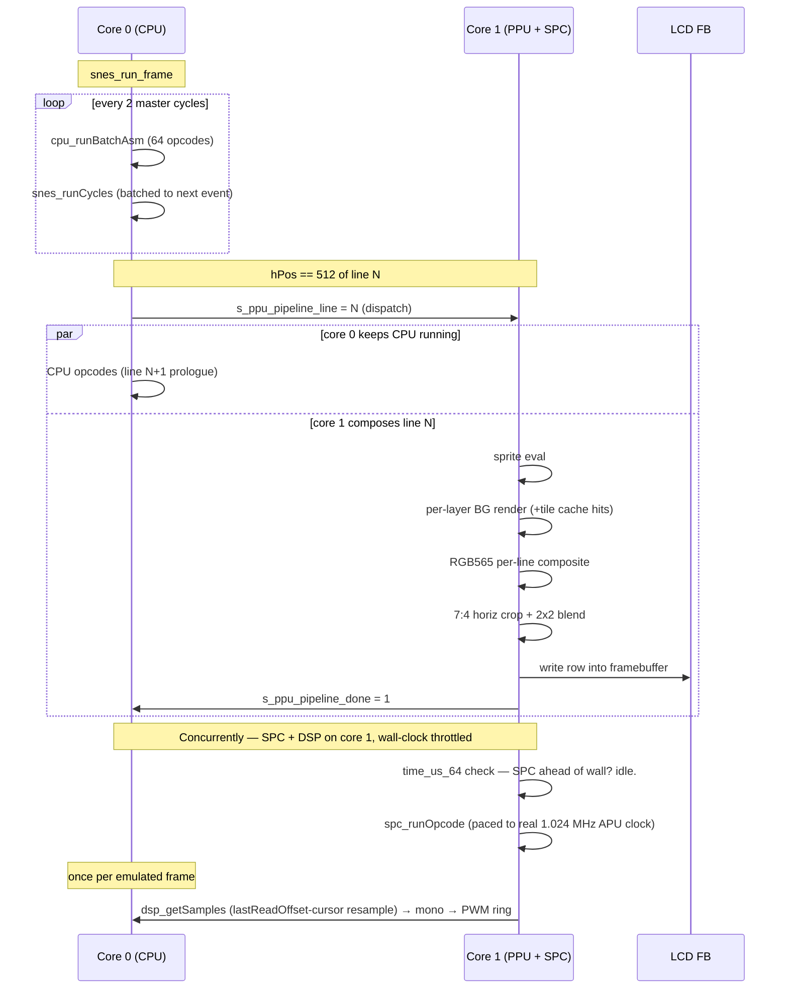

# ThumbySNES

A bare-metal SNES emulator firmware for the [Thumby Color](https://thumby.us/)
(RP2350 Cortex-M33 @ 300 MHz, 520 KB SRAM, 128×128 RGB565 LCD).
Flashes as a single `.uf2`, exposes the device as a USB drive for dragging
`.smc` / `.sfc` ROMs onto it, and runs them with a ROM picker and in-game
menu — the same shape as [ThumbyNES](../ThumbyNES).

Built on a heavily-modified [LakeSnes](https://github.com/elzo-d/LakeSnes)
core. CPU dispatch is a 256-handler ARM Thumb-2 inline-assembly state
machine running in `time_critical.snes` flash; PPU/SPC/DSP run on the
second core; LCD output is a per-line 2×2 RGB565 blend with horizontal
crop ("FILL" mode).

> **tl;dr** — a 520 KB MCU at 300 MHz running SNES ROMs at 7–25 fps.
> Got there by rewriting the 65816 dispatcher in hand-rolled Thumb-2
> asm, pinning hot paths to SRAM, building a block-map bus, splitting
> PPU / SPC / DSP across both cores, collapsing the per-pixel composite
> into per-line RGB565, and squeezing every frame with a tile-row
> decode cache + DMA fast path + bitmask-parallel blend. See the
> [Performance](#performance) section below for the full catalog.

## Build

### Host (development / test ROM verification)

```bash
cmake -B build -S .
cmake --build build -j8
./build/snesbench path/to/rom.smc 600    # headless N-frame benchmark
./build/sneshost  path/to/rom.smc        # SDL2 runner (needs libsdl2-dev)
```

### Device (RP2350 firmware)

```bash
cmake -B build_device -S device \
      -DPICO_SDK_PATH=$HOME/mp-thumby/lib/pico-sdk
cmake --build build_device -j8
# Output: build_device/snesrun_device.uf2
# Stage:  cp build_device/snesrun_device.uf2 firmware/snesrun_device.uf2
```

Hold DOWN dpad while powering the device on to enter BOOTSEL — it
mounts as a USB drive in Windows; drag the `.uf2` over to flash.

## In-game controls

| Combo                          | Effect                                  |
| ------------------------------ | --------------------------------------- |
| MENU (long-press, ≥ 800 ms)    | exit to ROM picker                      |
| MENU (tap)                     | SNES Start                              |
| LB+RB chord (long-press)       | exit to ROM picker (broken-MENU units)  |
| LB+RB chord (tap)              | SNES Start                              |
| **MENU + UP** (edge)           | increase frameskip (0 → 1 → 2)          |
| **MENU + DOWN** (edge)         | decrease frameskip (2 → 1 → 0)          |

Default frameskip is 1 (render every other frame). The CPU and APU
emulate at full rate regardless of frameskip — only PPU rendering is
suppressed — so audio pitch and game logic are unaffected.

A small FPS counter sits in the top-left corner of every game.

## Architecture

### System view

Both M33 cores run concurrently out of a shared 520 KB SRAM. Hot
functions are pinned into `.time_critical.*` sections that the Pico
SDK copies from flash into SRAM at boot. ROMs are mmap'd from flash
XIP — zero-copy, addressed directly by the `cart_read` mapper.



### Per-frame execution — the dual-core pipeline

The central cleverness is that ppu_runLine isn't in the CPU's
critical path. Core 0 runs 65816 opcodes until hPos=512 of each
scanline, then *dispatches* the line to core 1 and keeps running
CPU. Core 1 composites the line and blits to the LCD framebuffer in
parallel. The hand-off is a pair of `volatile int` flags
(`s_ppu_pipeline_line` / `s_ppu_pipeline_done`) — no mutex, no DMA
channel, atomic 32-bit writes on M33.



Core 0 waits on `s_ppu_pipeline_done` before dispatching the *next*
line (`while (!done) { }`) — so the pipeline's critical path is
`max(cpu_line_work, ppu_line_work)`. Today they're roughly balanced
(core 1 slightly heavier due to the PPU composite).

### Memory layout

```
Flash (16 MB, XIP)                     SRAM (520 KB)
──────────────────────                 ─────────────────────────
┌──────────────────┐  0x10000000       ┌──────────────────┐  0x20000000
│ bootloader + SDK │                   │ ram_vector_table │
├──────────────────┤                   ├──────────────────┤
│ .text / .rodata  │                   │ .data (hot code) │
│ (cold code)      │                   │ .time_critical.* │
│                  │                   │  — cpu_runBatch  │
├──────────────────┤                   │  — ppu_runLine   │
│ FatFs image      │                   │  — snes_runCycle │
│ (USB-MSC mount)  │                   │  — bit-lane LUT  │
│  ├─ test_cpu.sfc │                   ├──────────────────┤
│  ├─ FFII.sfc     │                   │ BSS              │
│  ├─ Zelda.sfc ...│◄────┐             │  — LakeSnes stat │
│                  │     │ readMap[]   │  — drivers       │
└──────────────────┘     │ direct ptr  │  — picker bufs   │
                         └──────────────┤                  │
                                        ├──────────────────┤
                                        │ heap (~297 KB)   │
                                        │  Snes struct    │
                                        │   └─ WRAM 128 K │
                                        │  Apu struct     │
                                        │   └─ ARAM  64 K │
                                        │  Ppu struct     │
                                        │   ├─ VRAM  64 K │
                                        │   ├─ bgLine 2 K │
                                        │   └─ tile cache │
                                        │      4 K (#27)  │
                                        │  Cart RAM 0-64 K│
                                        ├──────────────────┤
                                        │ stack            │
                                        └──────────────────┘
```

Runtime heap demand ≈ 265 KB on a typical 2 KB SRAM game (SMW,
Zelda), 297 KB on a Star Fox-class 64 KB-SRAM game. Headroom is
~30 KB — tight but comfortable.

### CPU bus — block-map fast path

The 24-bit SNES address space is divided into 4096 × 4 KB blocks.
Each `readMap[block]` is either a direct pointer (WRAM / mapped ROM)
or the sentinel `SNES_MAP_SPECIAL` (registers, DMA, APU ports,
unmapped). This replaces the 6-8 cascading if-checks in LakeSnes's
`snes_rread` with one array lookup for the ~95% of reads that hit
plain memory.

```
cpu wants byte at SNES adr (24-bit)
        │
        ▼
  block = (adr >> 12) & 4095
  ptr   = snes->readMap[block]
        │
        ├── ptr  <  SNES_MAP_LAST ──► slow path (snes_rread, switch)
        │                              │ PPU $2100-$213f
        │                              │ APU $2140-$217f
        │                              │ input $4016/$4017
        │                              │ regs  $4200-$421f
        │                              │ DMA   $4300-$437f
        │                              │ cart SRAM / open bus
        │
        └── ptr >= SNES_MAP_LAST  ──► fast path (WRAM / ROM direct)
                                       │ speed = readMapSpeed[block]
                                       │ dma_handleDma(speed)
                                       │ pendingCycles += speed
                                       │ return ptr[adr & 0xfff]
                                       │
                                       └── ~4 ARM instructions for
                                           the overwhelmingly common
                                           path: ROM fetch for the
                                           next opcode / operand.
```

Cycle bookkeeping rides along: the fast path accumulates into
`pendingCycles` and flushes once per opcode in `cpu_runOpcode` via
`snes_flushCycles`. That reduces `snes_runCycles` calls from ~1.8M
to ~600K per frame.

### CPU dispatcher — ARM Thumb-2 asm

The 65816 core is 256 opcode handlers in a single naked function in
`src/cpu_asm.c`, run 64 opcodes per call as `cpu_runBatchAsm`.
Across opcodes we keep the 65816 registers pinned in ARM callee-saved
regs, only spilling when a bus-access helper needs to call back into C:

```
┌──────────────────────────────────────────────────────────┐
│ cpu_runBatchAsm(cpu, 64)                                 │
│                                                          │
│ prologue:                                                │
│   push  {r4-r11, lr}                                     │
│   sub   sp, #FSZ            ; scratch frame (80 B)       │
│   ldm   r0, {r4-r11}        ; load A, X, Y, SP, PC, P,   │
│                             ; Cpu*, Snes* from struct    │
│                                                          │
│ ┌──────────────────────────────────────────────────┐     │
│ │ Dispatch loop (64 iterations)                    │     │
│ │                                                  │     │
│ │   bl    .Lfetch              ; r0 = next opcode  │     │
│ │   tbb   [pc, r0]             ; jump table        │     │
│ │                                                  │     │
│ │   → opcode handler (200-3000 byte routine) ─┐    │     │
│ │     · keeps state in r4-r11                 │    │     │
│ │     · calls .Lrd / .Lwr / .Lidl for bus     │    │     │
│ │     · updates flags in r9 (packed P)        │    │     │
│ │   ◄────────────────────────────────────────┘     │     │
│ │                                                  │     │
│ │   subs  r12, #1; bne dispatch                    │     │
│ └──────────────────────────────────────────────────┘     │
│                                                          │
│ epilogue:                                                │
│   stm   r0, {r4-r11}        ; write back to Cpu struct   │
│   add   sp, #FSZ                                         │
│   pop   {r4-r11, pc}                                     │
└──────────────────────────────────────────────────────────┘

Register pinning:                  Bus helpers preserve:
  R4  = 65816 A                      r4-r11 (AAPCS callee-saved)
  R5  = 65816 X                      SR0 (caller's r0 scratch)
  R6  = 65816 Y                      FLR (saved LR slot)
  R7  = 65816 SP
  R8  = 65816 PC                   Call-outs to C:
  R9  = packed P flags               snes_cpuRead(mem, adr)
  R10 = Cpu*                         snes_cpuWrite(mem, adr, v)
  R11 = Snes*                        snes_cpuIdle(mem, waiting)
```

See the [ASM dispatcher debugging history](#asm-dispatcher-debugging-history-april-2026)
section below for the two bugs this merge uncovered and how we
tracked them down without a JTAG probe.

### Cross-core interactions

| Channel | Direction | Mechanism | Synchronisation |
|---|---|---|---|
| CPU → PPU dispatch | C0 → C1 | `s_ppu_pipeline_line` write | `s_ppu_pipeline_done` spin |
| PPU → CPU completion | C1 → C0 | `s_ppu_pipeline_done` write | C0 spin-waits before next dispatch |
| CPU → SPC register | C0 → C1 | `snes->apu->inPorts[4]` | byte-atomic, no mailbox |
| SPC → CPU register | C1 → C0 | `snes->apu->outPorts[4]` | byte-atomic, no mailbox |
| DSP → CPU audio | C1 → C0 | 1024-slot DSP sample ring, `lastReadOffset` cursor | pulled once per emulated frame; producer throttled to wall clock |
| CPU VRAM writes | C0 → (shared) | direct `ppu->vram[]` write | no sync — games avoid mid-render writes |

## Performance

Emulating a 21.48 MHz 65816 + 32.04 MHz SPC700 + 256×224 composited PPU
at audio rate on a 300 MHz Cortex-M33 with 520 KB SRAM is, to put it
mildly, a tight budget. We started at **~4.8 fps** on content scenes with
vanilla LakeSnes. We're now at **~7 fps heavy gameplay / ~20-25 fps
menus & light content** — a 2-5× improvement depending on scene. This
section documents how.

### Current results (device, 2026-04-14 baseline + 2026-04-16 additions)

| Scene                         | FPS    | Notes                          |
|-------------------------------|:------:|--------------------------------|
| FFII flying intro             | ~20    | Light: 1 BG, few sprites       |
| FFII menus                    | ~20-24 | Light-medium                   |
| FFII first gameplay           | ~7-8   | Heavy: full BG + sprites + DMA |
| Zelda ALTTP title/load        | ~16-20 | Medium                         |

Host benchmark (`snesbench … --xip`, 900 frames × 3 reps, x86-64).
Two sessions of additions landed in April 2026 — shown cumulatively
against the pre-session baseline:

| ROM                | Baseline | Post +26-30 | Post +31-33 | Total Δ |
|--------------------|---------:|------------:|------------:|--------:|
| FFII               |  534 fps |     555 fps |     893 fps | **+67%** |
| Zelda ALTTP        |  438 fps |     522 fps |     708 fps | **+62%** |
| SMW                |  327 fps |     344 fps |     435 fps | **+33%** |
| Super Metroid      |  520 fps |     527 fps |     679 fps | **+31%** |
| Chrono Trigger     |  679 fps |     664 fps |     800 fps | **+18%** |

**The 2026-04-16 session split in two halves**:
- **Optimisations 26-30** (DMA block-copy fast path, tile-row cache,
  window-mask precompute, LUT-in-SRAM, packed RGB565 blend) focused
  on collapsing redundant work inside the PPU + DMA paths.
- **Optimisations 31-33** (`dma_handleDma` fast-exit inline,
  `snes_runCyclesFast` inline, tile-major RGB565 composite) followed
  a fresh re-profile that showed `ppu_runLine` at 46% and per-opcode
  bus overhead at ~20%.

The gain is **asymmetric by scene complexity** — light scenes (FFII
title, Chrono Trigger intro) gain 50-70%; heavy gameplay scenes
(SMW overworld, Super Metroid) gain 25-35%. This is expected: the
per-opcode cost levers (#31, #32) save constant-rate work, but heavy
scenes spend proportionally more time on PPU sprite eval, extra BG
layers, and VRAM traffic — areas the 26-33 levers only partly touch.
The next round of candidates (sprite-eval rewrite, single-walk
tile-major, accuracy drops) is sized for the heavy end of the
spectrum. See `PERF.md` for the full catalog and known-gaps list.

Device numbers pending flash. Expect device gains to be smaller than
host because the dual-core pipeline already hides some of core 0's
new slack behind core 1's PPU work — L33 (tile-major composite) is
the only lever that directly reduces core 1 cost.

### The journey, chronologically

The work split roughly into five passes:

**Pass 1 — make it fit.** snes9x2002 was the obvious choice but its
architecture carried a 4 MB graphics buffer — impossible on 520 KB
SRAM even after aggressive reduction. Switched to LakeSnes (pure C,
per-scanline native, ~6500 LOC) and patched its `pixelBuffer` from
978 KB → 2 KB (one scanline), adding a scanline callback so the
frontend could consume + downscale each line before the next one
stomped it. **This single architectural choice is the only reason this
emulator exists on this MCU.** Paired with a zero-copy XIP ROM loader
(`cart_load` takes the caller's flash pointer; `snes_loadRom` skips
its power-of-2 mirror malloc), so up to 4 MB ROMs live directly in
flash — no SRAM copy, no mapper pre-processing.

**Pass 2 — the cheap wins.** 300 MHz overclock, `LAKESNES_HOT` section
markers pinning hot top-level functions into SRAM (dodges flash XIP
cache misses on the inner loop), `double` → `float` for APU catch-up
math (M33 has a single-precision FPU — doubles went through softfloat
at ~50 cycles per op), `-O3 -ffunction-sections -fdata-sections
-Wl,--gc-sections` for dead-strip. Reverted `-flto` (code bloat
exceeded M33's 16 KB icache — slight regression). Also caught an
upstream bug: `snes_catchupApu` casts the cycle accumulator to `int`
before running SPC opcodes, permanently losing fractional cycles on
tight CPU polls — this was the root cause of SMW hanging during its
SPC handshake. Fixed by running while accumulator > 0.0f. (Still in
the single-core fallback; no longer in the hot path on device thanks
to Pass 5's dual-core split.)

**Pass 3 — collapsing the per-pixel tax.** The profile showed
`ppu_getPixel` consuming **47%** of frame time — it's called 224 × 256
= ~57K times per frame, iterates 4-5 layer slots per pixel, and does a
function-call-per-pixel window check inside the hot loop. This pass
replaced that with:
  - **Per-line BG layer cache** (`bgLine[layer][priority][x]`). Each
    BG layer is decoded tile-by-tile into a 256-byte array once per
    scanline, then read as array lookups during composite. Splits
    hi/lo priority into separate buffers so the compositor jumps
    straight to the right slot.
  - **Tile-decode bit-lane LUT.** 256-entry byte→8-bit-lane expansion
    table. Replaces each tile's 8 × {shift + AND + OR} inner loop with
    pointer derefs + array reads. ~2× faster per 4bpp tile. Shared by
    `ppu_renderBgLine` AND `ppu_evaluateSprites`.
  - **Per-line empty-slot flag** (`bgLineNonEmpty[L][P]`). The
    compositor skips full 256-wide passes for fully-transparent
    slots — common (empty BG3 on outdoor scenes, BG2 on HUD-only
    screens).
  - **Per-line RGB565 full composite** (`ppu_composeLineRgb565`).
    Walks the mode's layer-slot list once per line bottom-up, writing
    RGB565 directly via the CGRAM cache (below). Replaces the per-pixel
    `ppu_handlePixel` walk (8-12 slot iterations per pixel with
    function-call-per-pixel window checks) with O(slots + pixels)
    tight array passes. Hands a 256-pixel RGB565 line straight to the
    frontend — no BGRX-bytes intermediate, no per-pixel channel math.
  - **CGRAM → RGB565 LUT with brightness baked in.**
    `cgramRgb565[256]`, lazy rebuild on `$2100`/`$2121`/`$2122` writes
    via `cgramDirty` flag. Collapses the per-pixel 3-channel brightness
    math + byte-pack into a single `uint16_t` array read.
  - **`skipColorMath`.** Drops subscreen fetch + add/sub blending.
    Loses SNES transparency / fade effects; cuts per-pixel work nearly
    in half for games that used color math heavily.
  - **`renderXStart` / `renderXEnd`.** With FILL-mode cropping 16 px
    off each side of the 128×128 LCD, 32 pixels per line are invisible.
    Skip them — 12% fewer per-pixel calls.

Measured: Zelda 4.8 → 8 fps, FFII ≈5 → 9.6 fps.

**Pass 4 — dual core.** The M33 is dual-core. Compile flag
`THUMBYSNES_DUAL_CORE=1`:
  - **Core 0**: 65816 CPU, bus, DMA, input, USB, LCD SPI DMA.
  - **Core 1**: SPC700 + DSP, PPU scanline composite.
  - `snes_catchupApu` becomes a no-op on dual-core builds; the
    per-master-cycle `apuCatchupCycles` float accumulator update is
    skipped (saves one FPU multiply + add per ~1-2M `snes_runCycle`
    calls per frame).
  - `inPorts`/`outPorts` between CPU and SPC are byte-atomic on M33 —
    no mailbox, no spinlock, games' polling loops tolerate natural
    cross-core latency.
  - PPU scanline hand-off via `s_ppu_pipeline_line` /
    `s_ppu_pipeline_done` at `hPos == 512`. Core 0 dispatches the
    current line to core 1 and continues running CPU opcodes; core 1
    composites the line and blits to the LCD framebuffer via the
    RGB565 callback.

**Pass 5 — ARM asm dispatcher.** The 65816 opcode dispatch loop was
the remaining big lever. Wrote a 256-handler Thumb-2 dispatcher as a
single naked function, 150 KB of source across `src/cpu_asm.c`, keeping
the 65816 registers in callee-saved ARM regs (R4-R11) across a batch
of opcodes. 64 opcodes per `cpu_runBatchAsm` call. Bus-access helpers
(`.Lrd`, `.Lwr`, `.Lidl`, `.Lfetch`) preserve r4-r11 across BLX back
into the C-side `snes_cpuRead` / `snes_cpuWrite` / `snes_cpuIdle`.
Devirtualised those calls too (`THUMBYSNES_DIRECT_CPU_CALLS=1` — direct
BL not indirect BLX through a function pointer). Block-based memory
map (`snes->readMap`, 4096 × 4 KB blocks) resolves ~95% of reads in
4 instructions. Per-opcode cycle accumulator (`snes->pendingCycles`)
flushed once per opcode, reducing `snes_runCycles` calls from ~1.8M
to ~600K per frame. The final merge uncovered two latent bugs that
took a ROM-based bisection harness to debug — see [ASM dispatcher
debugging history](#asm-dispatcher-debugging-history-april-2026)
below for the war story.

**Session 2026-04-16 first half — five more levers.** Closing
sub-optimisations collected across the codebase audit:

  - **DMA block-copy fast path** (`dma.c:340`). Detects the common
    DMA tile-upload pattern — WRAM/ROM A-bus → PPU `$2118`/`$2119`,
    remap mode 0 — and bypasses `snes_read` + `snes_writeBBus` +
    `ppu_write` dispatch entirely. Goes straight through the readMap
    block pointer and writes directly into `ppu->vram[]` preserving
    openBus + vramPointer semantics. Remap modes 1-3 (rare) fall
    through to the canonical slow path.
  - **Persistent tile-row decode cache** (`ppu.c:314`). 256-entry
    direct-mapped cache keyed on `{tile & 0x5fff, row, bitDepth,
    tileAdrBase>>12}`. Each slot stores post-palette-offset bytes.
    Epoch counter bumped on every VRAM byte-write gives zero-cost
    invalidation — stale entries automatically miss. Miss path
    **fuses** cache storage into the existing decode loop so miss
    has ~zero extra cost; hit path skips the 8-iteration decode,
    saving ~50 cycles per hit. Host: Zelda +19%, SMW +5%, Chrono
    Trigger –2% (noise).
  - **Per-slot window-mask precompute** (`ppu.c:565`). When a layer
    slot is windowed, build a 256-byte mask once from the window
    registers + combine logic, then index `winMask[x]` in the
    per-pixel loop instead of calling `ppu_getWindowState` 256 times.
    Helps games with windows (lantern halos, spell transitions).
  - **Bit-lane LUT into SRAM** (`ppu.c:71`). The 2 KB byte→8-lane
    table was in flash `.rodata` — each XIP cache miss was ~100
    cycles and tile decode derefs it 4-8 times per tile. Section
    attribute `.time_critical.snes_lut` copies it into SRAM at
    boot. Device-only (host's x86 L1 already handles it).
  - **Packed-32 RGB565 blend** (`device/snes_run.c:46`). The 2×2
    blend in the scanline callback was 9 shifts + 3 ANDs + 3 adds
    per call. Rewrote with the classic bit-mask-parallel-add trick
    `((a ^ b) & 0xF7DE) >> 1 + (a & b)` — ~4 ARM ops — and added a
    32-bit packed variant `rgb565_avg2_x2` that blends two RGB565
    pairs per call, used by the vertical blend inner loop
    (128 pixels → 64 pair-aligned iterations).

**Session 2026-04-16 second half — three profile-directed levers.**
A fresh gprof run against the device-equivalent build
(`THUMBYSNES_DIRECT_CPU_CALLS=1`) showed `ppu_runLine` at 46% and
per-opcode bus overhead (DMA dispatch + cycle scheduler) at ~20%.
Three matched levers:

  - **`dma_handleDma` fast-exit inline** (`dma.h`, `dma.c`). Every
    CPU read / write / idle calls `dma_handleDma(snes->dma, cycles)`
    — ~40 million times per frame — and 99.9% of those calls find
    nothing pending and immediately return. The function body was
    renamed to `dma_handleDmaSlow`; a new `static inline` in the
    header checks the three pending flags (`dmaState`,
    `hdmaInitRequested`, `hdmaRunRequested`) and early-returns
    without a function call. The slow body only runs when DMA is
    actually active.

  - **`snes_runCyclesFast` inline fast path** (`snes.h`). The
    batched cycle scheduler spends most of its calls in the
    trivial case "advance hPos by `cycles` within a single
    non-event region, no IRQ edge crossed". Hoisted that case to a
    `static inline` that falls through to the slow
    `snes_runCycles` when any of: `hp` is at an event boundary
    (0, 16, 512, 1104, ≥ 1356), `hp == hTimer * 4 && hIrqEnabled`,
    `hp + cycles` crosses the next event boundary, or `hp + cycles`
    crosses the 536 DRAM-refresh point. Wired into
    `snes_cpuRead/Write/Idle` and `snes_flushCycles`.

    *The bug story*: first cut of this fast path skipped the
    `snes->apuCatchupCycles` update on single-core (host) builds,
    starving the SPC of cycles. Every ROM rendered black. Fixed
    by adding the accumulator tick inside the fast body (compiled
    out on `THUMBYSNES_DUAL_CORE=1` where the SPC runs free on
    core 1). Test-ROM-based bisection caught it in one flash.

  - **Tile-major RGB565 composite** (`ppu.c`,
    `ppu_emitBgSlotRgb565`). The old per-line flow wrote each BG
    layer into a 256-byte `bgLine[L][P][x]` palette-index buffer,
    then the compositor read it back pixel-by-pixel to produce
    RGB565. The new emit function walks the tilemap for one
    (layer, priority) slot and emits RGB565 directly into the
    output line — skipping the 2 KB intermediate write-then-read
    per slot entirely. The tile-row decode cache (#27) makes the
    extra walk cheap: hits are 8-byte palette-offset-applied copies
    from a pre-decoded cache slot.

    Trade-off: each BG layer is now walked **twice** per line
    (once per priority slot) vs the old one-walk-two-priorities
    pattern, which can partially cancel the savings on scenes
    with many unique tiles and low cache hit rate. Heavy scenes
    gain less than light ones as a result.

See [`PERF.md`](PERF.md) for the full 33-item optimisation catalog
with file:line references. [`STATUS.md`](STATUS.md) holds the current
functional status, known bugs, and memory breakdown.

### Where time went, pre-L31-33 (re-profile, 2026-04-16 afternoon)

Before landing the last three levers we ran a fresh gprof against
the device-equivalent host build (`THUMBYSNES_DIRECT_CPU_CALLS=1`)
on FFII + Zelda. Device uses the dual-core pipeline so the host
profile only approximates device behavior, but the broad picture
maps over:

| % of frame time | Function | Called /frame | Notes |
|---:|---|---:|---|
| **46%** | `ppu_runLine` | 224 | all PPU work for one scanline |
| 11% | `dma_handleDma` | 44 K | dispatched from every CPU access |
| 9% | `snes_runCycles` | 23 K | batched cycle scheduler |
| 7% | `dsp_cycle` | 500 | APU sample generation (on core 1 on device) |
| 6% | `snes_cpuRead` | 37 K | CPU opcode bus fetch |
| ~21% | everything else | | |

That profile drove the three 2026-04-16-late levers (#31, #32,
#33 — described below). The *post-*L33 profile has NOT been
re-taken — asymmetric results by scene (light +60%, heavy +25%)
suggest the balance has shifted, but we don't yet know where.
**A fresh profile on a heavy-content ROM (SMW overworld, Zelda
dungeon with rain) is the prerequisite before picking the next big
project.**

Candidate next levers, best guess pre-reprofile:

1. **Sprite eval rewrite** — `ppu_evaluateSprites` walks all 128
   OAM entries per line, unchanged by any of the 2026-04-16
   additions. On heavy-sprite scenes this is the biggest known
   untouched cost. Candidates include per-line sprite index
   caching, sprite-tile cache paralleling (#27), or moving sprite
   eval to core 1 ahead of the composite.
2. **Single-walk tile-major composite** — L33 walks the tilemap
   twice per BG layer (once per priority slot). A single-walk
   variant emitting to two "priority strata" in one pass would
   close the gap on layer-dense scenes where the extra walk
   currently bites.
3. **Aggressive accuracy drops** — mode 7 as flat BG, mosaic
   off, hires 5/6 collapsed to mode 1, interlace off, BGRX legacy
   path stubbed out. Speed-over-fidelity project policy; tiny
   risk. Small per-game wins.
4. **Inline WRAM path in top-4 ASM opcodes** — LDA/STA imm+abs+dp
   hit `.Lrd`/`.Lwr` via BLX even for plain WRAM readMap hits.
   Inlining saves ~6-8 cycles per opcode on ~25% of executed
   ops. ~1 day of ASM surgery. Estimated +1-2 fps.
5. **Lower internal render resolution** — render at 128×112
   directly instead of 256×224 + downscale. ~4× fewer output
   pixels but requires PPU teaching half-resolution sampling.
   Major surgery.

## ASM dispatcher debugging history (April 2026)

The Thumb-2 dispatcher was generated opcode-by-opcode then merged into
one giant naked function. After the merge games rendered black or
glitched and the CPU appeared to hang. Two latent bugs were responsible
for almost every failure mode:

### Bug 1 — `r0` clobber by `.Lidl` / `.Lwr`

These two helpers set `r0 = r11` (Snes pointer) before `blx`-ing the
C-side `snes_cpuIdle` / `snes_cpuWrite`. They restored LR via the `FLR`
stack slot but left `r0` in its post-call state.

The RMW body (`.Lrmw{8,16}_body`, used by `ASL`, `LSR`, `ROL`, `ROR`,
`INC`, `DEC`, `TRB`, `TSB` for memory operands) reads the byte into
`r0`, calls `.Lidl` for the modify cycle, then expects `r0` still to
hold the byte before invoking the per-op routine pointer through `S4`.
The pre-fix sequence ended up shifting the *Snes pointer* and writing
the result back to memory — corrupting whatever the dp / abs / abs,X
address pointed at. Real games saw broken VRAM uploads and OAM tables;
the dedicated test ROM hung at test 49 (ASL dp).

**Fix**: a new `SR0` stack slot. `.Lidl` and `.Lwr` save caller-`r0`
into `SR0` on entry and restore it before `bx lr`. The fix is wholly
in the helpers, so all 173+ callsites benefit without per-site changes.
`FSZ` bumped 72 → 80 to accommodate the slot (8-byte aligned).

```asm
.Lidl:                                       ; r0 = Snes* internally,
    str  r0, [sp, #SR0]                      ; preserved for caller
    str  lr, [sp, #FLR]
    mov  r0, r11
    movs r1, #0
    ldr  r3, [sp, #FID];  blx r3             ; snes_cpuIdle(snes, false)
    ldr  lr, [sp, #FLR]
    ldr  r0, [sp, #SR0];  bx lr
```

### Bug 2 — Missing Thumb bit on internal function pointers

The RMW body indirects through a per-opcode routine pointer stored in
`S4`:

```asm
ldr  r3, =.Lasl_rmw8     ; load address of internal helper
str  r3, [sp, #S4]
b.w  .Lrmw8_body
…
ldr  r3, [sp, #S4]
blx  r3                  ; ⟵ requires r3.bit0 == 1 for Thumb mode
```

There are 48 such `ldr r3, =.LXXX` literals (ASL/LSR/ROL/ROR × 8/16-bit
× a dispatch table per addressing mode). Without `.thumb_func` markers
on the targets, GAS emits the bare label address — bit 0 is 0. `blx r3`
then attempts an ARM-mode switch, the M33 raises a UsageFault, and the
default fault handler enters an infinite loop. The user-visible symptom
was *hangs immediately on the first ASL/LSR/ROL/ROR/etc.*, with the
on-device trace overlay frozen at `op00 n0`.

**Fix**: append `+1` to every internal function-pointer literal:

```asm
ldr  r3, =.Lasl_rmw8+1
```

48 sites patched in a single regex pass.

### Diagnostic infrastructure (compile-time, off by default)

A four-field trace on the `Cpu` struct — `lastOpcode`, `lastPb`,
`lastPc`, `opcodeCount` — lets the on-device picker overlay surface
the dispatcher's last fetched opcode and PC. Updated from both the ASM
loop (after the opcode fetch, before `bx r0`) and from `cpu_runOpcode`
(C path, after fetch). Build with `-DTHUMBYSNES_ASM_TRACE=1` to enable;
adds 6 instructions per ASM dispatch, 3 stores per C dispatch.

The trace turned bisection from "rebuild the firmware 8 times to
binary-search 256 handlers" into "see what opcode the screen says is
hung". Bug 2 was found in two flashes: full-fallback build worked,
ASM-only build hung at `n0` → dispatcher prologue / first opcode →
inspection → missing Thumb bit.

### Test ROM

`tools/gen_test_rom.py` generates a 32 KB LoROM cart that exercises 87
opcode patterns, writing `'P'`/`'F'` plus the failed-test number into
WRAM[0..3] for the picker to read out at the bottom of the screen.
Coverage:

- Loads/stores: `LDA/LDX/LDY` and `STA/STX/STY` in immediate, dp, abs,
  abs,X, abs,Y, dp,X, dp,Y, indirect, indirect-indexed, stack-relative,
  long, long-indexed forms.
- ALU: `ORA/AND/EOR/ADC/SBC/CMP/CPX/CPY` 8- and 16-bit.
- Shifts/rotates: `ASL/LSR/ROL/ROR` on accumulator and memory (dp, abs,
  abs,X) in both 8- and 16-bit modes.
- Increments: `INC/DEC` accumulator, dp, abs, abs,X, plus `INX/DEX/INY/DEY`.
- Branches: every conditional + `BRA` + `JMP abs` + `JMP (ind)` +
  `JMP (abs,X)` + `JMP long` + `JSR/RTS` + `JSL/RTL`.
- Stack: `PHA/PLA/PHX/PLX/PHY/PLY/PHP/PLP/PEA/PEI/PER`.
- Mode: `REP/SEP` flag toggles, `XCE` round-trip, `CLC/SEC/CLD/SED/SEI/CLI/CLV`.
- Misc: `BIT` (dp/abs/imm), `STZ` (dp/abs/abs,X), `TRB/TSB`, `MVN/MVP`
  block move, `WDM`, `XBA`, `TCD/TDC/TSX/TXS/TXY/TYX/TAX/TAY/TXA/TYA`.

Run on host:

```bash
python3 tools/gen_test_rom.py roms/test_cpu.sfc
./build/snesbench roms/test_cpu.sfc 100
# expects: *** TEST ROM PASSED (all tests OK) ***
```

Run on device: drop `roms/test_cpu.sfc` on the USB drive, pick it from
the menu. A green `PASS 87` at the bottom means all opcodes work; a red
`FAIL#N eXX aYY` shows which test failed and the expected vs actual
byte.

The bisection script `/tmp/toggle_asm.py` (not committed) flips ranges
of opcodes between ASM and C-fallback for debugging — useful next time
a regression appears.

## Audio

The audio pipeline has three moving parts across both cores:

```
Core 1                         Core 0                     PWM DMA
─────────                      ─────────                  ─────────
 SPC700 + DSP ─► sampleBuffer   snes_get_audio            snes_audio_pwm
 (wall-clock    (1024 slots,    (once per emulated         ring (4096),
  throttled)     stereo)          frame)                   drain @ 22050 Hz
               │                │                         │
 sampleOffset++│                │                         │
               ▼                ▼                         ▼
           [producer]      [resample 32040→             [9-bit DAC
                            N output, via                output on GP23]
                            lastReadOffset]
```

**Producer — core 1.** `snes_apu_core1_loop` (`src/snes_core.c`) runs
`spc_runOpcode` in a tight loop, interleaved with PPU line renders.
The SPC's emulated clock is 1.024 MHz (= 32,040 samples/sec × 32 APU
cycles/sample, same NTSC and PAL). Without throttling, core 1's
native SPC rate is ~20–30× real-time whenever PPU has slack — which
laps the 1024-slot sample ring many times per pull and causes the
consumer's resample ratio to wobble with emulation framerate.

The loop throttles against `time_us_64()`:

```c
cycles_target = cycles_ref + wall_elapsed_us * 1025280 / 1e6;
if (apu->cycles > cycles_target) idle;   // SPC ahead — pause
else spc_runOpcode(spc);                  // catch up
```

`wall_ref_us` / `cycles_ref` are captured when a ROM loads and reset
on unload. When PPU work starves SPC (heavy scenes), the throttle
simply doesn't fire and SPC runs flat-out at whatever core 1 can
manage — music tempo slows gracefully but pitch stays correct
because the resample ratio is driven by actual production rate.

**Consumer — core 0, per emulated frame.** `snes_get_audio` calls
`dsp_getSamples`, which now tracks a `lastReadOffset` cursor on the
ring. Each call resamples the range `[lastReadOffset, sampleOffset]`
— the samples actually produced since the previous pull — into
however many output samples the caller asked for. If the producer
has lapped the ring (> 1020 samples unread), we clamp to the most
recent 1020 and drop the older ones; if the producer hasn't advanced
at all (SPC stalled), we hold the last sample to avoid a click.

**Output — PWM DMA, 22050 Hz wall.** `device/snes_audio_pwm.c` runs
a 9-bit PWM carrier on GP23 with a timer IRQ at 22050 Hz that pulls
one sample per firing from a 4096-slot ring and writes the duty
cycle. Ring depth ≈ 185 ms at the output rate, which smooths over
the per-frame pull cadence. The push loop in `device/snes_run.c`
refills up to 3072 slots per pull so the ring stays primed even at
sub-10 fps emulation.

**Single-core (host) build.** None of the throttle logic applies —
host keeps the classic `snes_catchupApu` per-access path where CPU
progress drives SPC cycles. `dsp_getSamples`'s cursor-tracked
resample still works there and behaves identically to the original
per-frame `wantedSamples=534` flow at steady 60 fps.

## License

ThumbySNES glue: see `LICENSE` (matches snes9x's non-commercial terms
for redistribution compatibility).

Vendored `LakeSnes` is MIT-licensed — see `vendor/lakesnes/LICENSE`.
